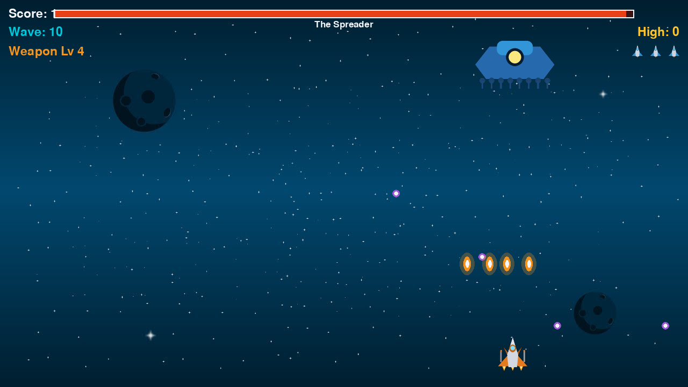
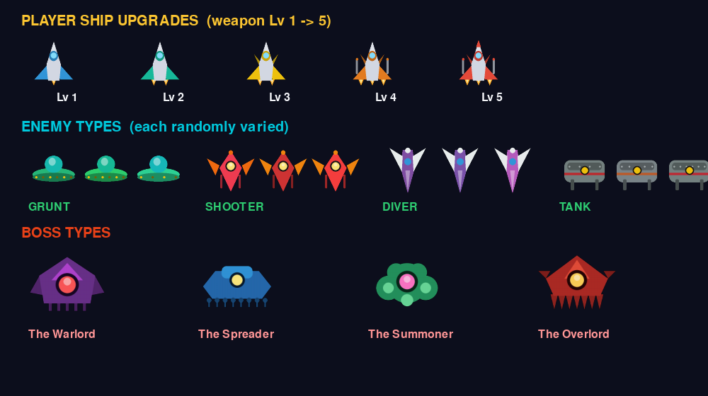
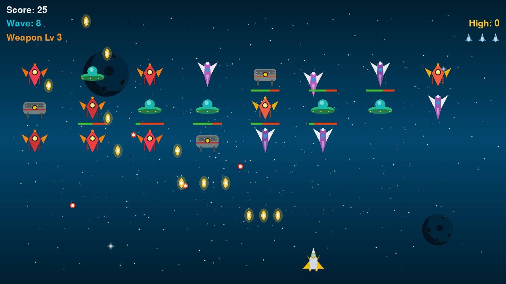
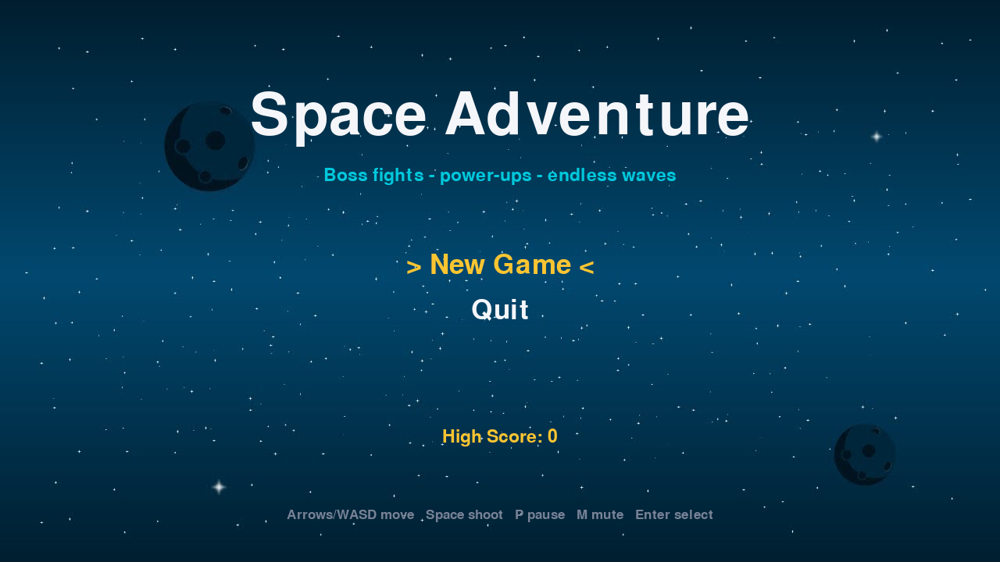

<h1 align="center">🚀 Space Adventure</h1>

<p align="center">
  A complete arcade shooter built from scratch in <b>Python</b> with <b>pygame</b>.<br>
  Endless waves of enemies that <b>shoot and dive at you</b>, <b>boss fights</b>,
  <b>power-up rewards</b>, and a full <b>menu &amp; save system</b>.
</p>

<p align="center">
  
  
  
  
  
</p>

<p align="center">
  
</p>

<p align="center"><i>Boss fight — health bar, radial bullet spread, and falling power-ups.</i></p>

---

## ✨ Features

### Procedurally generated ships
- **Every ship is drawn from scratch in code** — no reused sprite art. Each enemy archetype has its own silhouette, and each individual enemy gets small random colour/detail variation, so a wave never looks copy-pasted.
- **Your ship visibly upgrades** with its weapon level — more engines, wings, and cannons appear as you power up.

<p align="center">
  
</p>

### Combat that fights back
- **Enemies attack you** — "shooter" and "tank" enemies fire aimed bullets downward.
- **Dive-bombers** — enemies break formation and dive straight at your position.
- **Unpredictable attacks** — enemy fire and boss patterns use randomised timing, trajectories, and pattern selection, so attacks can't be memorised — you have to react.
- **Fair collisions** — you only take damage from an actual hit; dodging never costs health, and hitboxes are inset so near-misses don't count.
- **4 boss types**, one every 5th wave — each with its own shape, colour, attack rotation, and health that scales with tier (see below).

### Upgrade your ship
- **Weapon-upgrade system** — collect `^` upgrades to level up your guns: single → double → triple → heavy → 5-way spread. At high levels each bullet also deals **double damage**.
- **Risk & reward** — taking a hit knocks your weapon down a level, so upgrades are worth protecting.
- **Power-up drops** from kills — 🔶 Rapid Fire, 🔷 Multi-Shot, 🛡️ Shield, ➕ Extra Life, 💣 Screen Bomb, 💲 Score Bonus, ⬆️ Weapon Upgrade.

### Progression
- **Endless escalating waves** — more enemies, faster movement, tougher types (tanks join deeper waves), and higher-tier bosses the further you go.
- **Scoring & high score** — points per hit, per kill, and per wave cleared, with a **persistent high score**.

### Enemy types

| Enemy | Behaviour |
| ----- | --------- |
| **Grunt** | Basic formation fodder. |
| **Shooter** | Fires aimed bullets down at you. |
| **Diver** | Breaks formation and dive-bombs your position. |
| **Tank** | Heavy armour, high value — shows up in deeper waves. |

### Boss types

| Boss | Signature attacks |
| ---- | ----------------- |
| **The Warlord** | Radial spread + aimed 3-round bursts. |
| **The Spreader** | Curtain of rain fire + radial spread. |
| **The Summoner** | Aimed bursts and relentless minion spawns. |
| **The Overlord** | Rotating spiral fire, spread, and aimed bursts. |

### A full game, not a demo
- **Main menu** — New Game · **Continue** (resume a saved run) · Quit.
- **Pause menu** — Resume · **Save &amp; Quit** · Quit.
- **Game Over screen** with Play Again / Main Menu / Quit.
- **Save system** — persist your run to disk and continue later.

### Built to be solid
- **Smooth 60 FPS, frame-rate independent** — movement scales by delta time, identical on any hardware.
- **Crash-resistant** — missing images or no audio device degrade gracefully; runs headless (CI/servers).
- **Zero-freeze design** — no blocking sleeps anywhere; hit feedback uses a non-blocking invulnerability timer.
- **Clean, modular codebase** — logically separated package (see below).

<p align="center">
  
  
</p>

## 🎮 Controls

| Action           | Keys                     |
| ---------------- | ------------------------ |
| Move             | `← ↑ ↓ →` or `W A S D`   |
| Fire             | `Space`                  |
| Pause menu       | `P` or `Esc`             |
| Navigate menus   | `↑` / `↓`                |
| Select           | `Enter` / `Space`        |
| Mute / Unmute    | `M`                      |
| Quit             | `Q`                      |

## 🛠️ Getting Started

### Prerequisites
- Python **3.8+**

### Installation & Run

```bash
# 1. Clone the repository
git clone https://github.com/faisalrasheed442/space-invaders-pygame.git
cd space-invaders-pygame

# 2. (Recommended) create a virtual environment
python -m venv .venv
# Windows:  .venv\Scripts\activate
# macOS/Linux:  source .venv/bin/activate

# 3. Install dependencies
pip install -r Requirements.txt

# 4. Play!
python main.py
```

## ✅ Testing

The game logic is covered by a **39-test pytest suite** that runs fully
headless (no window or audio needed), plus a boot smoke test — all wired into
**GitHub Actions CI** across Python 3.9 / 3.11 / 3.12.

```bash
pip install -r requirements-dev.txt
pytest
```

The suite covers weapon upgrades, all four boss types attacking, enemy fire and
dives, every power-up effect, wave progression, collisions (including the
"dodging never costs health" fairness rule), distinct procedural sprites, and
the full save / continue / game-over lifecycle.

## 🧩 Architecture

The game is organized as a small, readable package — each module has a single
responsibility:

```
space-invaders-pygame/
├── main.py               # Thin entry point
├── game/
│   ├── settings.py       # All tuning constants & colors (balance in one place)
│   ├── assets.py         # Fault-tolerant image / sound / font loading
│   ├── sprites.py        # Procedural ship generation (all art drawn in code)
│   ├── savegame.py       # JSON save / continue + high-score persistence
│   ├── entities.py       # Player, Enemy, Boss, Bullet, PowerUp, Explosion
│   ├── ui.py             # Keyboard-navigable menus, HUD, overlays
│   └── game.py           # State machine, waves, combat, collisions
├── tests/                # Headless pytest suite
├── .github/workflows/    # CI (pytest on 3.9 / 3.11 / 3.12)
├── pic/                  # Sprites, background, audio
├── Requirements.txt      # Runtime deps
├── requirements-dev.txt  # + test deps
└── README.md
```

**Design highlights**

- **Finite state machine** — `menu → playing → paused → game_over`, each with its own input and rendering path.
- **Delta-time movement** (`speed × dt`), with `dt` clamped to avoid collision "tunneling" after a stall.
- **Data-driven design** — enemy archetypes, power-up drop weights, and all balancing live in `settings.py`.
- **Fault-tolerant loading** — a helper returns a safe placeholder surface / silent sound stub whenever an asset or the audio device is unavailable.
- **Safe iteration** — bullets, enemies, and power-ups are culled over list copies to avoid mutate-while-iterating bugs.
- **Cross-platform paths** via `pathlib`, so it behaves identically on Windows, macOS, and Linux.

## 🗺️ Gameplay Loop

1. Clear a wave of enemies to earn a **wave-clear bonus** and advance.
2. Every **5th wave** is a **boss fight** — survive its patterns and destroy it for a big score and a guaranteed reward.
3. Collect **power-ups** to stack Rapid Fire, Multi-Shot, and Shields.
4. Lose all your lives and it's **Game Over** — beat your **high score** and try again.

## 📄 License

Released under the **MIT License** — see [`LICENSE`](LICENSE). Sprite and audio
assets are used for educational/demo purposes.

---

<p align="center">Made with 🐍 and pygame by <a href="https://github.com/faisalrasheed442">Faisal Rasheed</a></p>
